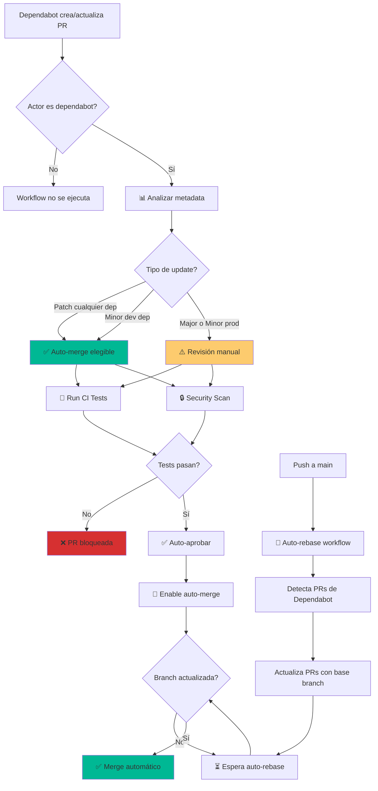

# 🤖 Dependabot AutoMerge

> Sistema completamente automatizado para mantener las dependencias actualizadas mediante PRs de Dependabot que se aprueban, sincronizan y fusionan automáticamente cuando cumplen criterios de seguridad.

[](https://github.com/features/actions)
[](https://github.com/dependabot)
[](https://github.blog/changelog/2021-02-19-github-actions-workflows-triggered-by-dependabot-prs-will-run-with-read-only-permissions/)

## ✨ Características Principales

- ✅ **Auto-merge inteligente** para patches y minor updates de dev dependencies
- 🔄 **Auto-rebase** automático cuando la rama base cambia
- 🔒 **Validación de seguridad** con npm audit antes de cada merge
- 🧪 **CI completo** con lint, build y security checks
- 👁️ **Revisión manual** para major updates y producción
- 📊 **Visibilidad total** con resúmenes detallados en GitHub Actions
- 🏷️ **Agrupación inteligente** de dependencias para reducir PRs

## 📁 Estructura del Proyecto

```
.
├── .github/
│   ├── dependabot.yml                    # Configuración de Dependabot
│   └── workflows/
│       ├── dependabot-automerge.yml      # Workflow de análisis, CI y auto-merge
│       └── auto-rebase-dependabot.yml    # Workflow de auto-rebase en push a main
├── scripts/
│   └── check-dependabot-status.sh        # Script para ver estado de PRs
├── src/
│   └── app/                              # Aplicación Next.js de ejemplo
└── README.md
```

## 🔄 Flujo de Trabajo Completo



## 🚀 Implementación Rápida (15 minutos)

### 1️⃣ Habilitar Dependabot en GitHub

**`Settings` → `Security` → `Code security and analysis`**

- ✅ **Dependabot alerts**: Activa alertas de vulnerabilidades
- ✅ **Dependabot security updates**: Crea PRs para vulnerabilidades
- ✅ **Dependabot version updates**: Crea PRs para actualizaciones

### 2️⃣ Configurar Permisos de GitHub Actions

**`Settings` → `Actions` → `General` → `Workflow permissions`**

- ✅ **Read and write permissions**
- ✅ **Allow GitHub Actions to create and approve pull requests**

> 🔑 **Crítico**: Sin estos permisos, auto-merge fallará

### 3️⃣ Configurar Branch Protection

**`Settings` → `Branches` → `Add branch protection rule`**

```yaml
Branch name pattern: main

✅ Require a pull request before merging
  Require approvals: 0  # Dependabot auto-aprueba
  
✅ Require status checks to pass before merging
  ✅ Require branches to be up to date before merging
  
  Required status checks:
  - 📊 Analyze Dependabot PR
  - 🧪 Run CI Tests
  - 🔒 Security Scan

✅ Allow auto-merge
✅ Automatically delete head branches
```

> ⚠️ **Importante**: "Require branches to be up to date" activa el botón de update en PRs

### 4️⃣ Copiar Workflows a tu Repositorio

```bash
# Copiar configuración de Dependabot
cp .github/dependabot.yml <tu-repo>/.github/

# Copiar workflows
cp .github/workflows/dependabot-automerge.yml <tu-repo>/.github/workflows/
cp .github/workflows/auto-rebase-dependabot.yml <tu-repo>/.github/workflows/

# Ajustar rutas en dependabot.yml si es necesario
# directory: "/src/app"  # Cambiar según tu estructura
```

### 5️⃣ Personalizar Configuración

**Edita `.github/dependabot.yml`**:

```yaml
# Cambiar directorio si tu proyecto tiene estructura diferente
directory: "/src/app"  # o "/", "src/", etc.

# Ajustar horario
schedule:
  interval: "weekly"
  day: "monday"
  time: "09:00"
  timezone: "Europe/Madrid"  # Tu zona horaria
```

### 6️⃣ Confirmar Funcionamiento

```bash
# Push de cambios
git add .github/
git commit -m "feat: Configure Dependabot auto-merge"
git push

# Esperar a que Dependabot detecte configuración (puede tomar 1-2 minutos)

# Ver PRs de Dependabot
gh pr list --author "app/dependabot"

# Ejecutar script de estado
./scripts/check-dependabot-status.sh
```

## 📊 Criterios de Auto-Merge

### ✅ AUTO-MERGE AUTOMÁTICO

| Tipo Update | Dependencia | Acción |
|-------------|-------------|---------|
| **Patch** <br> `1.2.3 → 1.2.4` | Cualquiera (prod/dev) | ✅ Auto-aprobación + Auto-merge |
| **Minor** <br> `1.2.0 → 1.3.0` | Solo desarrollo | ✅ Auto-aprobación + Auto-merge |
| **GitHub Actions** | Cualquier versión | ✅ Auto-aprobación + Auto-merge |

### ⚠️ REVISIÓN MANUAL REQUERIDA

| Tipo Update | Dependencia | Acción |
|-------------|-------------|---------|
| **Major** <br> `1.x.x → 2.0.0` | Cualquiera | ⚠️ CI corre + Comentario + Espera revisión |
| **Minor** <br> `1.2.0 → 1.3.0` | Producción | ⚠️ CI corre + Comentario + Espera revisión |

### 🔍 Ejemplo de Decisión

```javascript
// package.json antes
{
  "dependencies": {
    "next": "14.0.0",      // Producción
    "react": "18.2.0"      // Producción
  },
  "devDependencies": {
    "eslint": "8.50.0",    // Desarrollo
    "typescript": "5.2.0"  // Desarrollo  
  }
}

// Updates de Dependabot:
next: 14.0.0 → 14.0.1       ✅ Patch prod → AUTO-MERGE
next: 14.0.0 → 14.1.0       ⚠️ Minor prod → MANUAL REVIEW
next: 14.0.0 → 15.0.0       ⚠️ Major → MANUAL REVIEW

eslint: 8.50.0 → 8.50.1    ✅ Patch dev → AUTO-MERGE
eslint: 8.50.0 → 8.51.0    ✅ Minor dev → AUTO-MERGE
eslint: 8.50.0 → 9.0.0     ⚠️ Major → MANUAL REVIEW
```

## 🔧 Configuración Detallada

### Dependabot Configuration

El archivo `.github/dependabot.yml` configura:

#### 🔄 Rebase Strategy

```yaml
rebase-strategy: "auto"
```

- **`auto`**: Rebasa PRs automáticamente cuando `main` cambia
- **`disabled`**: Requiere comando manual `@dependabot rebase`

#### 📦 Agrupación de Dependencias

Reduce el número de PRs agrupando updates relacionados:

```yaml
groups:
  # Todas las dev deps minor/patch en un solo PR
  development-dependencies:
    dependency-type: "development"
    update-types: ["minor", "patch"]
  
  # Todos los patches de prod en un solo PR
  production-dependencies:
    dependency-type: "production"
    update-types: ["patch"]
  
  # Next.js ecosystem junto
  nextjs-ecosystem:
    patterns: ["next", "react", "react-dom", "@next/*"]
    update-types: ["minor", "patch"]
```

#### 🏷️ Labels Automáticos

```yaml
labels:
  - "dependencies"     # Identifica PRs de dependencias
  - "automerge"        # Activa lógica de auto-merge
```

#### 🚫 Dependencias Ignoradas

```yaml
ignore:
  - dependency-name: "webpack"
    update-types: ["version-update:semver-major"]
  - dependency-name: "typescript"
    update-types: ["version-update:semver-major"]
```

### Workflows

#### 1. Dependabot Auto-Merge (`dependabot-automerge.yml`)

**Trigger**: `pull_request` (opened, reopened, synchronize, ready_for_review)

**Jobs**:

1. **📊 Analyze PR**: Extrae metadata y determina elegibilidad
2. **🧪 CI Tests**: Ejecuta lint + build
3. **🔒 Security Scan**: Ejecuta `npm audit`
4. **✅ Auto-Approve**: Aprueba PRs elegibles
5. **🚀 Auto-Merge**: Activa auto-merge
6. **💬 Manual Review Comment**: Comenta en PRs que requieren revisión

#### 2. Auto-Rebase Dependabot (`auto-rebase-dependabot.yml`)

**Trigger**: `push` a `main`

**Proceso**:
1. Detecta todas las PRs abiertas de Dependabot
2. Llama a GitHub API para actualizar cada PR con la rama base
3. GitHub automáticamente re-ejecuta CI checks
4. Auto-merge procede si los checks pasan

```bash
# Cuando haces push a main:
git push origin main

# El workflow automáticamente:
# 1. Lista PRs de Dependabot: #42, #43, #44
# 2. Actualiza cada una con main
# 3. CI se ejecuta automáticamente
# 4. Auto-merge procede si elegible
```

## 🔒 Seguridad y Validaciones

### Pre-Merge Checks

Cada PR ejecuta:

```bash
✅ Metadata Analysis
   ├─ Dependency type (production/development)
   ├─ Update type (major/minor/patch)
   ├─ Previous & new versions
   └─ Auto-merge eligibility

✅ CI Tests
   ├─ npm ci (install clean dependencies)
   ├─ npm run lint (code quality)
   └─ npm run build (ensure builds)

✅ Security Scan
   ├─ npm audit (vulnerability check)
   └─ Audit level: moderate+ blocks
```

### Branch Protection

- ✅ Requiere todos los checks pasen
- ✅ Requiere branch actualizada con main
- ✅ Auto-delete de branches después de merge
- ✅ Auto-merge habilitado

## 🛠️ Troubleshooting

### ❌ Error: Cache dependency path not found

**Síntoma**:
```
Error: Some specified paths were not resolved, unable to cache dependencies.
```

**Solución**: El workflow ya está configurado correctamente sin `cache-dependency-path`. Si ves este error:

```yaml
# ❌ Incorrecto
- uses: actions/setup-node@v4
  with:
    cache-dependency-path: './src/app/package-lock.json'

# ✅ Correcto
- uses: actions/setup-node@v4
  with:
    cache: 'npm'
    # cache se detecta automáticamente con working-directory
```

### ❌ "Only users with push access can use that command"

**Síntoma**: Comentario `@dependabot rebase` falla con error de permisos

**Solución**: El workflow usa GitHub API directamente (no comandos de Dependabot):

```bash
# El workflow usa:
gh api /repos/{repo}/pulls/{pr}/update-branch

# No usa: @dependabot rebase (requiere permisos especiales)
```

### ❌ PRs quedan "Waiting for status to be reported"

**Síntoma**: Checks marcados como "Expected" pero nunca se ejecutan

**Causas**:
1. Branch protection configurada antes de que existieran los workflows
2. El workflow no se disparó por permisos insuficientes
3. Actualización de PR no disparó evento `synchronize`

**Solución**:
```bash
# Opción 1: Re-run workflows manualmente
gh run rerun <run-id>

# Opción 2: Push dummy commit a la PR
git commit --allow-empty -m "chore: trigger workflows"
git push

# Opción 3: Cerrar y reabrir PR
gh pr close <pr-number>
gh pr reopen <pr-number>
```

### ❌ Auto-merge no se activa

**Verificar permisos**:
```bash
# Ver si Actions tiene permisos de write
gh api repos/:owner/:repo/actions/permissions

# Debe retornar:
{
  "enabled": true,
  "allowed_actions": "all",
  "selected_actions_url": "..."
}
```

**Verificar auto-merge habilitado en branch protection**:
```bash
gh api repos/:owner/:repo/branches/main/protection \
  --jq '.allow_auto_merge'

# Debe retornar: true
```

### ❌ Dependabot no crea PRs

**Verificar configuración**:
```bash
# Ver si Dependabot está activo
gh api repos/:owner/:repo/vulnerability-alerts

# Ver configuración actual
cat .github/dependabot.yml

# Validar YAML
yamllint .github/dependabot.yml
```

**Causa común**: Directorio incorrecto en `dependabot.yml`

```yaml
# ❌ Si package.json está en raíz
directory: "/src/app"

# ✅ Debe ser
directory: "/"
```

## 📊 Monitoreo y Dashboards

### Ver Estado de PRs de Dependabot

```bash
# Script incluido
./scripts/check-dependabot-status.sh

# Output:
# ╔═══════════════════════════════════════╗
# ║    Dependabot PRs Status Report       ║
# ╚═══════════════════════════════════════╝
# 
# 🤖 Total PRs: 3
# ✅ Auto-merge elegibles: 2
# ⚠️  Require manual review: 1
```

### Comandos útiles con GitHub CLI

```bash
# Listar todas las PRs de Dependabot
gh pr list --author "app/dependabot"

# Ver PRs auto-merge
gh pr list --author "app/dependabot" --label "automerge"

# Ver detalles de una PR
gh pr view <PR_NUMBER>

# Ver checks de una PR
gh pr checks <PR_NUMBER>

# Ver workflow runs recientes
gh run list --workflow="Dependabot Auto-Merge"

# Ver logs de un run
gh run view <RUN_ID> --log
```

### Dashboard en GitHub

### Dashboard en GitHub

**Ver en Actions**:
- `Actions` → `Dependabot Auto-Merge` → Ver runs recientes
- Cada run muestra resumen con:
  - Tipo de update
  - Dependencias afectadas
  - Decisión de auto-merge
  - Resultados de CI

## 📝 Casos de Uso

### ✅ Ideal Para

- 🚀 Proyectos con muchas dependencias (10+ packages)
- 🔄 Equipos que necesitan actualizaciones frecuentes
- 🔒 Aplicaciones que priorizan seguridad
- ⏱️ Proyectos donde el tiempo de mantenimiento es limitado
- 🧪 Codebases con test coverage >80%

### ⚠️ Considerar Antes de Usar

- ❌ **Sin tests**: Auto-merge sin tests puede romper producción
- ❌ **Dependencias críticas**: Algunos packages requieren validación manual
- ❌ **Baja tolerancia al riesgo**: Equipos que prefieren revisión humana
- ⚡ **Deployments frecuentes**: Cada merge puede disparar deploy

## 🎯 Estrategias de Configuración

### Conservadora (Bajo Riesgo)

```yaml
# dependabot.yml
groups:
  # Solo patches juntos
  patch-updates:
    update-types: ["patch"]

# Solo auto-merge patches
# Workflow verifica: update-type == "version-update:semver-patch"
```

### Balanceada (Recomendada)

```yaml
# Actual configuración de este repo
# - Patches: auto-merge
# - Minors dev: auto-merge
# - Minors prod: manual review
# - Majors: manual review
```

### Agresiva (Alto Riesgo, Alta Velocidad)

```yaml
# Auto-merge TODO excepto majors
# Requiere test coverage >90%
# Monitoreo de producción robusto
# Rollback automático
```

## 🔄 Flujo de Trabajo Típico

### Lunes 9:00 AM - Dependabot Crea PRs

```
🤖 Dependabot detecta 8 updates disponibles:
  
  ✅ Auto-merge (6):
  - #42: eslint 8.50.0 → 8.50.1 (patch dev)
  - #43: typescript 5.2.0 → 5.2.1 (patch dev)
  - #44: next 14.0.3 → 14.0.4 (patch prod)
  - #45: react 18.2.0 → 18.2.1 (patch prod)
  - #46: @types/node 20.8.0 → 20.9.0 (minor dev)
  - #47: prettier 3.0.0 → 3.1.0 (minor dev)
  
  ⚠️ Manual review (2):
  - #48: next 14.0.4 → 14.1.0 (minor prod)
  - #49: webpack 5.88.0 → 6.0.0 (major)
```

### 9:05 AM - Workflows Se Ejecutan

```bash
# Para cada PR auto-merge:
📊 Analyze → ✅ Pass (patch/minor dev)
🧪 CI Tests → ✅ Pass (build success)
🔒 Security → ✅ Pass (no vulnerabilities)
✅ Auto-approve → ✅ Approved
🚀 Auto-merge → ✅ Enabled
```

### 9:10 AM - Primera PR Se Mergea

```
PR #42 (eslint patch):
✅ Todos los checks pasan
✅ Auto-approved by workflow
✅ Auto-merge enabled
🔄 Merged via squash
🗑️ Branch deleted
```

### 9:11 AM - Auto-Rebase Se Activa

```bash
# Push a main dispara auto-rebase workflow
🔄 Auto-rebase detecta 5 PRs abiertas
📡 Actualiza PR #43, #44, #45, #46, #47 con nuevo main
✅ CI se re-ejecuta en todas
```

### 9:15-9:30 AM - PRs Se Mergean Secuencialmente

Cada PR se mergea cuando:
1. Branch está actualizada con main
2. Todos los checks pasan
3. Auto-merge está enabled

### 9:30 AM - Solo PRs Manuales Quedan

```
🎉 6 PRs auto-merged
⏳ 2 PRs esperando review manual

Notificación Slack:
"📦 6 dependency updates merged automatically
⚠️ 2 updates require manual review: #48, #49"
```

## 🧪 Testing y Validación

### Antes de Habilitar Auto-merge

```bash
# 1. Verifica que tu CI es robusto
npm run lint  # Debe pasar
npm run build # Debe pasar
npm test      # Si tienes tests

# 2. Prueba update manual
npm update <package>
npm run build
npm run dev

# 3. Simula PR de Dependabot
git checkout -b test/dependabot-simulation
# Actualiza una dependencia
git commit -m "build(deps): test dependabot"
git push
# Crea PR y verifica que workflows corren
```

### Después de Habilitar

```bash
# Monitorea primeros merges
gh pr list --author "app/dependabot"
gh run list --workflow="Dependabot Auto-Merge"

# Verifica producción después de merges
# Configura alerts para errores
# Revisa changelog semanal
```

## 🚨 Rollback de Updates Problemáticas

### Si un auto-merge rompe algo

```bash
# Opción 1: Revert rápido
gh pr list --state merged --author "app/dependabot" --limit 5
# Identifica el merge problemático
git revert <commit-sha>
git push origin main

# Opción 2: Pin version en package.json
# Edita package.json:
{
  "dependencies": {
    "problema-package": "1.2.3"  // Pin specific version
  }
}

# Opción 3: Ignorar en dependabot.yml
# En .github/dependabot.yml:
ignore:
  - dependency-name: "problema-package"
    versions: ["1.2.4", "1.2.5"]
```

## 📈 Métricas y KPIs

### Métricas a Trackear

```bash
# PRs mergeadas automáticamente por mes
gh pr list \
  --state merged \
  --author "app/dependabot" \
  --label "automerge" \
  --search "merged:>2024-01-01"

# Tiempo promedio de merge
gh pr list \
  --state merged \
  --author "app/dependabot" \
  --json createdAt,mergedAt

# Tasa de éxito de CI
gh run list \
  --workflow="Dependabot Auto-Merge" \
  --json conclusion
```

### KPIs Esperados

| Métrica | Valor Objetivo |
|---------|----------------|
| % Auto-merge exitosos | >95% |
| Tiempo promedio de merge | <15 minutos |
| PRs que requieren intervención | <10% |
| PRs revertidas | <1% |
| Vulnerabilidades abiertas | 0 |

## 🔗 Integración con Otros Servicios

### Slack Notifications

```yaml
# Agregar a dependabot-automerge.yml después de auto-merge job

- name: 📢 Notify Slack
  if: success()
  uses: slackapi/slack-github-action@v1
  with:
    webhook-url: ${{ secrets.SLACK_WEBHOOK }}
    payload: |
      {
        "text": "✅ Auto-merged ${{ needs.analyze-pr.outputs.dependency-names }}"
      }
```

### Monitoring (Datadog, New Relic)

```yaml
# Agregar después de merge
- name: 📊 Track Deployment
  run: |
    curl -X POST https://api.datadoghq.com/api/v1/events \
      -H "DD-API-KEY: ${{ secrets.DATADOG_API_KEY }}" \
      -d '{
        "title": "Dependency Update Merged",
        "text": "${{ needs.analyze-pr.outputs.dependency-names }}",
        "tags": ["dependabot", "automerge"]
      }'
```

## 📚 Recursos Adicionales

### Documentación

- [📖 Guía completa](../../docs/DependabotAutomerge.md) - Documentación detallada
- [🔧 Dependabot Config Reference](https://docs.github.com/en/code-security/dependabot/dependabot-version-updates/configuration-options-for-the-dependabot.yml-file)
- [🤖 Dependabot Metadata Action](https://github.com/dependabot/fetch-metadata)
- [🚀 GitHub Auto-merge](https://docs.github.com/en/pull-requests/collaborating-with-pull-requests/incorporating-changes-from-a-pull-request/automatically-merging-a-pull-request)

### Comunidad

- [GitHub Dependabot Discussions](https://github.com/orgs/community/discussions/categories/dependabot)
- [Changelog de Dependabot](https://github.blog/changelog/label/dependabot/)

### Ejemplos en Producción

- [GitHub Actions Toolkit](https://github.com/actions/toolkit)
- [Vercel](https://github.com/vercel/next.js)
- [Gatsby](https://github.com/gatsbyjs/gatsby)

## ❓ FAQ

<details>
<summary><strong>¿Es seguro auto-mergear dependencias sin revisión?</strong></summary>

**Respuesta**: Depende de tu test coverage y monitoreo:

- ✅ **Seguro** si tienes:
  - Test coverage >80%
  - CI robusto (lint + build + tests)
  - Monitoreo de producción
  - Rollback automático
  - Solo patches y minors dev

- ⚠️ **Riesgoso** si:
  - Sin tests
  - Sin monitoreo
  - Dependencias críticas
  - Sin rollback plan

**Recomendación**: Empieza conservador (solo patches), aumenta gradualmente.
</details>

<details>
<summary><strong>¿Qué pasa si un auto-merge rompe producción?</strong></summary>

**Respuesta**: Múltiples capas de protección:

1. **Prevención**: CI debe pasar (lint + build + tests)
2. **Detección**: Monitoreo detecta errores
3. **Rollback**: Revert commit automático o manual
4. **Learning**: Agregar a `ignore:` en `dependabot.yml`

```bash
# Rollback rápido
git revert <commit-sha>
git push origin main
```
</details>

<details>
<summary><strong>¿Cuántas PRs crea Dependabot por semana?</strong></summary>

**Respuesta**: Depende de:
- Número de dependencias (típico: 20-50)
- Frecuencia de updates de maintainers
- Tu configuración de `schedule:`

**Promedio**:
- Proyecto pequeño (10 deps): 2-5 PRs/semana
- Proyecto mediano (30 deps): 5-15 PRs/semana
- Proyecto grande (100+ deps): 20-50 PRs/semana

**Reducir con `groups:`**: Combina múltiples updates en 1 PR
```yaml
groups:
  all-dev-dependencies:
    dependency-type: "development"
# 10 PRs individuales → 1 PR agrupada
```
</details>

<details>
<summary><strong>¿Funciona con monorepos?</strong></summary>

**Respuesta**: ✅ Sí, configura múltiples directorios:

```yaml
updates:
  - package-ecosystem: "npm"
    directory: "/packages/frontend"
    # ...
  
  - package-ecosystem: "npm"
    directory: "/packages/backend"
    # ...
  
  - package-ecosystem: "npm"
    directory: "/packages/shared"
    # ...
```
</details>

<details>
<summary><strong>¿Cómo manejo private packages?</strong></summary>

**Respuesta**: Configura secrets:

```yaml
# dependabot.yml
registries:
  npm-github:
    type: npm-registry
    url: https://npm.pkg.github.com
    token: ${{ secrets.GITHUB_TOKEN }}

updates:
  - package-ecosystem: "npm"
    directory: "/"
    registries:
      - npm-github
```
</details>

## 🎓 Mejores Prácticas

1. ✅ **Empieza conservador**: Solo patches → Luego minors dev → Evalúa
2. ✅ **Monitorea primeros merges**: Verifica producción por una semana
3. ✅ **Revisa changelog semanalmente**: Aunque sea auto-merge
4. ✅ **Mantén CI rápido**: CI >10 minutos ralentiza auto-merge
5. ✅ **Pin dependencias críticas**: AWS SDK, payment gateways, etc.
6. ✅ **Agrupa updates**: Reduce PR fatigue con `groups:`
7. ✅ **Documenta excepciones**: Por qué ignoras ciertas dependencias
8. ✅ **Configura alertas**: Slack/email para merges y fallos

## ⚙️ Personalización Avanzada

### Custom Eligibility Logic

Edita `.github/workflows/dependabot-automerge.yml`:

```yaml
- name: 🔍 Check auto-merge eligibility
  id: check-eligibility
  run: |
    UPDATE_TYPE="${{ steps.metadata.outputs.update-type }}"
    DEPENDENCY_TYPE="${{ steps.metadata.outputs.dependency-type }}"
    DEPENDENCY_NAME="${{ steps.metadata.outputs.dependency-names }}"
    
    # Custom logic: No auto-merge para react
    if [[ "$DEPENDENCY_NAME" == "react" ]]; then
      echo "eligible=false" >> $GITHUB_OUTPUT
      exit 0
    fi
    
    # Custom logic: Auto-merge todos los patches
    if [[ "$UPDATE_TYPE" == "version-update:semver-patch" ]]; then
      echo "eligible=true" >> $GITHUB_OUTPUT
    else
      echo "eligible=false" >> $GITHUB_OUTPUT
    fi
```

### Custom Notifications

```yaml
- name: 📧 Send Email on Merge
  if: needs.analyze-pr.outputs.auto-merge-eligible == 'true'
  uses: dawidd6/action-send-mail@v3
  with:
    server_address: smtp.gmail.com
    server_port: 465
    username: ${{ secrets.MAIL_USERNAME }}
    password: ${{ secrets.MAIL_PASSWORD }}
    subject: "Dependency Auto-merged"
    body: "Merged: ${{ needs.analyze-pr.outputs.dependency-names }}"
    to: team@example.com
```

## 🎉 Siguientes Pasos

Una vez que tengas Dependabot funcionando:

1. 📊 **Configura métricas**: Track merge rate, revert rate
2. 🔔 **Agrega notificaciones**: Slack, email, Discord
3. 🧪 **Mejora tests**: Aumenta coverage para más confianza
4. 🚀 **Automatiza deploys**: Deploy automático después de merge
5. 📝 **Documenta runbook**: Qué hacer cuando algo falla
6. 🔍 **Revisa mensualmente**: Ajusta criterios según experiencia

## 📄 Licencia

MIT - Ver [LICENSE](LICENSE)

---

<div align="center">

**🤖 Mantén tus dependencias actualizadas automáticamente**

[Reportar Bug](https://github.com/tu-org/AutoMergeStrategies/issues) · [Solicitar Feature](https://github.com/tu-org/AutoMergeStrategies/issues) · [Contribuir](https://github.com/tu-org/AutoMergeStrategies/pulls)

</div>
