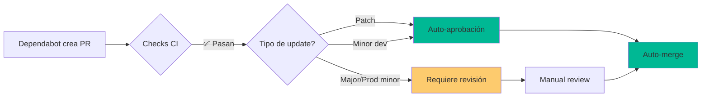

# Dependabot AutoMerge - Implementación de Ejemplo

Sistema automatizado para mantener las dependencias actualizadas mediante PRs de Dependabot que se aprueban y fusionan automáticamente cuando cumplen criterios de seguridad.

## ✅ Estado del Submódulo

- ✅ Dependabot configurado para npm y GitHub Actions
- ✅ Auto-merge para patches y minors (dev dependencies)
- ✅ CI automático con lint + build + security
- ✅ Auto-aprobación para updates seguros
- ✅ Manual review para major updates

## 📁 Estructura del Proyecto

```
.
├── .github/
│   ├── dependabot.yml             # Configuración de Dependabot
│   └── workflows/
│       └── dependabot-automerge.yml  # Workflow de auto-merge
├── scripts/
│   └── check-dependabot-status.sh    # Ver estado de PRs Dependabot
├── src/
│   └── app/                          # Aplicación Next.js (a crear)
└── README.md
```

## 🎯 Casos de Uso

- Proyectos con muchas dependencias que requieren actualizaciones frecuentes
- Equipos que necesitan mantenerse al día con parches de seguridad
- Automatización de updates menores y de parches sin revisión manual
- Mantenimiento continuo de dependencias de GitHub Actions

## 🔄 Flujo de Trabajo



## 🚀 Guía de Implementación Paso a Paso

### 1. Habilitar Dependabot en GitHub (5 minutos)

**Settings > Security > Code security and analysis**:

1. ☑ **Dependabot alerts**: Click **Enable**
   - Recibe alertas de vulnerabilidades conocidas
   
2. ☑ **Dependabot security updates**: Click **Enable**
   - Crea PRs automáticos para vulnerabilidades
   
3. ☑ **Dependabot version updates**: Click **Enable**
   - Crea PRs para mantener dependencias actualizadas

### 2. Configurar Permisos de GitHub Actions (2 minutos)

**Settings > Actions > General > Workflow permissions**:
- ☑ **Read and write permissions**
- ☑ **Allow GitHub Actions to create and approve pull requests**

**⚠️ Importante**: Dependabot necesita estos permisos para que el workflow pueda aprobar y mergear automáticamente.

### 3. Configurar Branch Protection (5 minutos)

**Settings > Branches > Add branch protection rule**:

Para `main`:
```
Branch name pattern: main

☑ Require a pull request before merging
  ☐ Require approvals: 0 (Dependabot auto-aprueba)
  
☑ Require status checks to pass before merging
  ☑ Require branches to be up to date before merging
  
  Status checks required:
  - 🧪 Run CI Tests
  - 🔒 Security Scan

☑ Allow auto-merge
☑ Automatically delete head branches
```

### 4. Crear Aplicación Next.js (Opcional)

Si no tienes aplicación, crea una:

```bash
cd src
npx create-next-app@latest app --typescript --tailwind --app --no-src-dir
```

O copia de otro submódulo:

```bash
cp -r ../AutoMergeFeature/src/app src/
```

### 5. Primera Prueba Manual (10 minutos)

Para probar el sistema sin esperar a que Dependabot cree PRs:

#### Simular un PR de Dependabot

1. **Crear una rama simulando Dependabot**:
```bash
cd src/app
git checkout -b dependabot/npm_and_yarn/next-15.1.0

# Actualizar una dependencia menor
npm update next@latest
git add package.json package-lock.json
git commit -m "build(deps): Bump next from 15.0.0 to 15.1.0"
git push -u origin dependabot/npm_and_yarn/next-15.1.0
```

2. **Crear PR en GitHub**:
   - Título: `build(deps): Bump next from 15.0.0 to 15.1.0`
   - Labels: `dependencies`, `automerge`
   - Body: Simular formato de Dependabot

3. **Observar el workflow**:
   - Ve a **Actions**
   - Verás `🤖 Dependabot Auto-Merge` ejecutándose
   - Revisa cada job

**⚠️ Nota**: Para prueba real, espera a que Dependabot cree un PR automáticamente (lunes a las 9:00 AM según configuración).

### 6. Monitorear PRs de Dependabot

```bash
# Ver estado de todos los PRs de Dependabot
./scripts/check-dependabot-status.sh

# Ver PRs con gh CLI
gh pr list --author "app/dependabot"

# Ver detalles de un PR específico
gh pr view <PR_NUMBER>
```

## 📊 Criterios de Auto-Merge

El workflow decide automáticamente qué PRs pueden fusionarse sin revisión:

### ✅ Auto-merge Elegible

- **Patches** (1.2.3 → 1.2.4):
  - Todas las dependencias (prod y dev)
  - Auto-aprobación + auto-merge
  
- **Minors de dev** (1.2.0 → 1.3.0):
  - Solo dependencias de desarrollo
  - Auto-aprobación + auto-merge

- **GitHub Actions**:
  - Todas las actualizaciones
  - Auto-aprobación + auto-merge

### ⚠️ Revisión Manual Requerida

- **Majors** (1.x.x → 2.0.0):
  - Cualquier dependencia
  - Requiere aprobación manual
  
- **Minors de producción** (1.2.0 → 1.3.0):
  - Dependencias de producción
  - Requiere aprobación manual

## 🔍 Configuración de Dependabot

El archivo [.github/dependabot.yml](.github/dependabot.yml) configura:

### Ecosistemas Monitoreados

1. **npm** (Node.js):
   - Directorio: `/src/app`
   - Frecuencia: Semanal (lunes 9:00 AM)
   - Límite: 10 PRs simultáneos

2. **github-actions**:
   - Directorio: `/`
   - Frecuencia: Semanal (lunes 10:00 AM)

### Agrupación de Updates

Para reducir cantidad de PRs, Dependabot agrupa:

- **development-dependencies**: Todas las dev deps (minor/patch)
- **production-dependencies**: Solo patches de prod deps
- **nextjs-ecosystem**: Next.js, React, React-DOM juntos

### Dependencias Ignoradas

Majors de estos paquetes requieren revisión manual:
- `webpack`
- `typescript`

## 🔒 Seguridad

### Validaciones Pre-Merge

Cada PR de Dependabot ejecuta:

1. **Metadata Analysis**: Extrae tipo de update, versiones
2. **CI Tests**: Lint + Build
3. **Security Scan**: `npm audit`
4. **Eligibility Check**: Determina si auto-merge es seguro

### Niveles de Seguridad

- **npm audit**: Bloquea si hay vulnerabilidades moderate+
- **Branch protection**: Requiere todos los checks pasen
- **Auto-delete branches**: Limpia ramas después de merge

## 🛠️ Troubleshooting

### Dependabot no crea PRs

**Verificar**:

```bash
# Ver si Dependabot está habilitado
gh api repos/:owner/:repo | jq '.has_dependabot'

# Ver alerts de Dependabot
gh api repos/:owner/:repo/dependabot/alerts
```

**Soluciones**:
1. Verificar que `dependabot.yml` está en `.github/`
2. Verificar sintaxis YAML con: https://www.yamllint.com/
3. Verificar que el directorio especificado existe

### Auto-merge no se activa

**Verificar**:

```bash
# Ver metadata del PR
gh pr view <PR_NUMBER> --json author,labels,checks

# Ver si el autor es dependabot[bot]
gh pr view <PR_NUMBER> --json author --jq '.author.login'
```

**Causas comunes**:
- El autor no es `dependabot[bot]`
- CI tests fallaron
- No tiene permisos de write en GitHub Actions

### CI falla en Dependabot PR

```bash
# Ver logs del workflow
gh run list --workflow="Dependabot Auto-Merge" --limit 5

# Ver detalles del run fallido
gh run view <RUN_ID> --log
```

**Soluciones**:
1. Verificar que `src/app/package.json` existe
2. Verificar que la actualización no rompe el build
3. Revisar logs de lint/build

### PRs requieren aprobación manual

Esto es esperado para:
- Major version updates
- Minor updates de producción

**Aprobar manualmente**:

```bash
# Revisar cambios
gh pr diff <PR_NUMBER>

# Aprobar si es seguro
gh pr review <PR_NUMBER> --approve

# Mergear
gh pr merge <PR_NUMBER> --squash
```

## 📊 Dashboard de Dependencias

### Ver todas las dependencias outdated

```bash
cd src/app
npm outdated
```

### Ver dependencias con vulnerabilidades

```bash
npm audit
```

### Ver PRs de Dependabot agrupados por estado

```bash
# Auto-merge elegibles
gh pr list --author "app/dependabot" --label "automerge"

# Requieren revisión manual
gh pr list --author "app/dependabot" --label "dependencies" | grep -v "automerge"
```

## 📝 Buenas Prácticas

1. **Revisar Regularly**: Aunque sea auto-merge, revisa el changelog mensualmente

2. **Test Locally**: Antes de mergear majors, prueba localmente:
   ```bash
   git fetch origin
   git checkout dependabot/npm_and_yarn/package-2.0.0
   cd src/app
   npm install
   npm run build
   npm run dev
   ```

3. **Monitor Production**: Después de merges de dependencias, monitorea producción

4. **Pin Critical Deps**: Para dependencias críticas, considera pin versions

5. **Review Groups**: Revisa qué dependencias se agrupan juntas

## 🎯 Resultado Esperado

Después de implementar:

1. ✅ Dependabot crea PRs automáticos cada lunes
2. ✅ Patches y minors (dev) se fusionan automáticamente
3. ✅ Majors y minors (prod) requieren revisión
4. ✅ CI valida cada update antes de merge
5. ✅ Seguridad mejorada con updates constantes

## 🔗 Recursos

- [Documentación completa](../../docs/DependabotAutomerge.md)
- [Dependabot Documentation](https://docs.github.com/en/code-security/dependabot)
- [dependabot.yml Reference](https://docs.github.com/en/code-security/dependabot/dependabot-version-updates/configuration-options-for-the-dependabot.yml-file)
- [Dependabot Fetch Metadata Action](https://github.com/dependabot/fetch-metadata)

## 🎉 Próximos Pasos Sugeridos

- Configurar notificaciones de Slack para merges de Dependabot
- Agregar tests de integración al CI
- Implementar snapshot testing para detectar breaking changes
- Configurar alertas de seguridad prioritarias

## 📄 Licencia

MIT - Ver [LICENSE](LICENSE)

---

**Nota**: Este es un ejemplo educativo. Ajusta los criterios de auto-merge según tu tolerancia al riesgo y nivel de test coverage.
